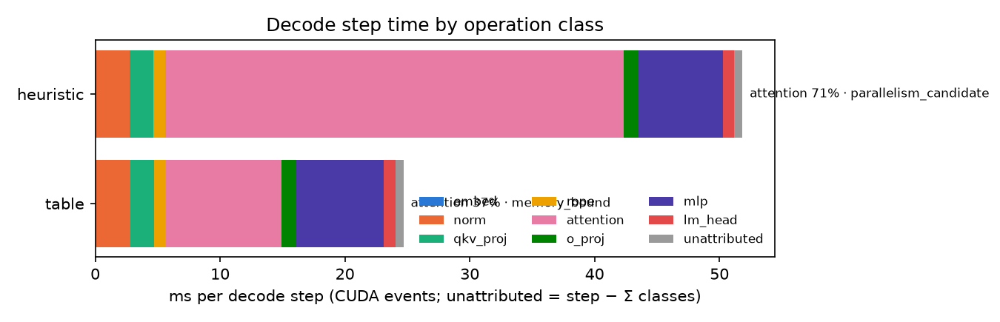

# Decode step의 연산 클래스 분해 (`serve diagnose`, 2026-09-27)

**결론.** 혼합 길이 배치(D1, `graduation_ragged`)에서 decode step 시간 중 attention이 차지하는 비중은 기본 휴리스틱에서 **70.9%**, 측정 테이블 정책에서 **37.5%**로 줄어든다. 남은 GEMM 클래스(qkv_proj·o_proj·mlp·lm_head)는 두 정책 모두에서 이미 DRAM 상한(하한 추정)의 63~90%에 있어 커널 선택으로 더 줄일 여지가 작다 — o_proj·mlp·lm_head는 `memory_bound` 판정이고 qkv_proj만 임계 θ=0.7 미만(63%대)이다. 균일 길이 배치(D2, `graduation_uniform`)에서는 attention 비중이 애초에 **19.2%**로 작고 두 정책의 선택이 같아 step 시간 차이가 없다 — PLAN.md §1 ②가 말하는 "균일 배치에서 이득이 없다"의 실측 근거다. 이 진단은 `performance_claim=false`이며 op-class 시간 분해가 목적이다. 여기 인용하는 step 시간 비율은 맥락일 뿐 속도 주장이 아니고, TPOT 개선 수치는 [2026-09-22 서빙 결과](2026-09-22-serving-results.md)에 이미 보고되어 있다.

## 방법

decode step을 8개 연산 클래스(`embed, norm, qkv_proj, rope, attention, o_proj, mlp, lm_head`)로 나누어 두 번 실행한다. **event 실행**은 클래스별 CUDA event로 GPU 시간을 잰다. **control 실행**은 op 타이머 없이 step 시간만 재서 event 실행이 더한 오버헤드를 따로 계산한다(`timer_overhead_pct`). 각 클래스의 바이트/FLOP은 **필수 트래픽만 세는 하한 추정**이라 `achieved_gbps`·`achieved_tflops`·`pct_dram`·`pct_tc`도 실제 값의 하한 추정이다. 판정은 임계 θ=0.7(DRAM 또는 텐서코어 상한의 70% 이상이면 `memory_bound`/`compute_bound`), `layer_mean_us`가 `launch_us`=5 µs 미만이면 `launch_bound`, attention이 두 상한 모두 미달이면 `parallelism_candidate`, 그 외는 `below_ceiling_unknown`. attention 행은 추가로 실측 dispatch 테이블(`demo_data/dispatch_paged_cold.csv`)에서 가장 가까운 셀을 찾아 고른 변형(`chosen_variant`)과 최선(`best_alternative`)의 손실(`regret`), attention만 최선으로 바꿨을 때 step 상한 배율(`amdahl_bound = 1/(1 - share + share/chosen_over_best)`)을 붙인다. 커널 내부 동작(스톨, 뱅크 충돌 등)은 이 보고서가 볼 수 없는 영역이며 Nsight Compute(`ncu`)의 몫이다. GPU 없이 같은 수치를 다시 만들려면 `serve diagnose-report`로 기록된 parquet에서 재계산한다(아래 재현 명령).

**대상.** Qwen/Qwen3-4B-Instruct-2507(bf16, 36 layers, H_q=32, H_kv=8, d=128), RTX 4090(측정 ceilings: DRAM 952.6 GB/s, 텐서코어 168.6 TFLOPS, ridge 177.0 FLOP/B). `--kv-gib 10 --warmup-runs 1 --warmup-steps 2`.

| 실행 | 시나리오 | 정책 | steps |
|---|---|---|---|
| D1 (혼합 길이) | `graduation_ragged`(32768×1 + 512×31) | heuristic, table:`dispatch_paged_cold.csv` | 63 |
| D2 (균일 길이) | `graduation_uniform`(512×32) | heuristic, table:`dispatch_paged_cold.csv` | 63 |
| D3 (자연어 held-out, 혼합 길이) | `heldout_text_ragged`(12288×1 + 384×27) | heuristic, model | 31 |

## 표 1. D1(혼합 길이) decode step, 클래스별 시간 분해 (`ops.csv`)

**표 1a. 정책 `heuristic`**

| op_class | gpu_us(ms) | share | pct_dram | verdict |
|---|---|---|---|---|
| embed | 0.03 | 0.1% | 1.2% | below_ceiling_unknown |
| norm | 2.74 | 5.3% | 1.8% | below_ceiling_unknown |
| qkv_proj | 1.91 | 3.7% | 63.2% | below_ceiling_unknown |
| rope | 0.92 | 1.8% | 2.7% | below_ceiling_unknown |
| attention | 36.76 | 70.9% | 21.0% | parallelism_candidate |
| o_proj | 1.16 | 2.2% | 70.5% | memory_bound |
| mlp | 6.74 | 13.0% | 86.1% | memory_bound |
| lm_head | 0.93 | 1.8% | 90.0% | memory_bound |

**표 1b. 정책 `table`**

| op_class | gpu_us(ms) | share | pct_dram | verdict |
|---|---|---|---|---|
| embed | 0.03 | 0.1% | 1.1% | below_ceiling_unknown |
| norm | 2.76 | 11.2% | 1.8% | below_ceiling_unknown |
| qkv_proj | 1.93 | 7.8% | 62.7% | below_ceiling_unknown |
| rope | 0.93 | 3.8% | 2.7% | below_ceiling_unknown |
| attention | 9.25 | 37.5% | 83.3% | memory_bound |
| o_proj | 1.14 | 4.6% | 71.2% | memory_bound |
| mlp | 7.06 | 28.6% | 82.2% | memory_bound |
| lm_head | 0.93 | 3.8% | 89.8% | memory_bound |

D1의 미귀속 시간(`unattributed_pct`)은 heuristic 1.25%, table 2.61%이고, 타이머 오버헤드(`timer_overhead_pct`, event/control 비교)는 각각 1.49% / 3.38%다.

## 표 2. D2·D3 요약(attention 비중, 미귀속, 타이머 오버헤드)

| 실행 | 정책 | attention share | unattributed | timer overhead |
|---|---|---|---|---|
| D2 uniform | heuristic | 19.2% | 2.77% | 4.19% |
| D2 uniform | table | 19.1% | 2.80% | 4.09% |
| D3 heldout_ragged | heuristic | 49.8% | 1.90% | 2.48% |
| D3 heldout_ragged | model | 23.7% | 2.82% | 3.84% |

D2에서는 두 정책 모두 attention이 `memory_bound`(DRAM 75.7%)로 판정되어 D1과 달리 정책 차이가 판정에 나타나지 않는다. D3에서는 heuristic만 `parallelism_candidate`(DRAM 24.1%)이고 model 정책은 `memory_bound`(DRAM 76.1%)다.

## 표 3. attention 선택 대 Amdahl 상한 (`attention_steps.csv` 기반, heuristic 정책 기준)

| 실행(참조 정책) | chosen_variant(num_splits) | best_alternative | regret | chosen_over_best | Amdahl 상한 | 실측 control step 비율(휴리스틱/참조) |
|---|---|---|---|---|---|---|
| D1 ragged (table) | flashdecoding_paged(0) | fd_s16_paged | 2.836 | 3.836 | 2.10배 | 2.139 |
| D2 uniform (table) | flashdecoding_paged(0) | flashdecoding_paged | 0.0 | 1.0 | 1.00배 | 0.998 |
| D3 heldout_ragged (model) | flashdecoding_paged(0) | fd_s16_paged | 1.820 | 2.820 | 1.47배 | 1.523 |

D1의 table 정책은 이웃 셀에서 이미 최선(`fd_s16_paged`, num_splits=16, regret 0.0)을 고른다. D3의 model 정책은 31 step 전부 `fd_s8_paged`(num_splits=8)를 골랐고, 그 이웃 셀의 실측 최선은 `fd_s16_paged`이지만 손실은 0.33%로 작다.

## 합격 기준(A1–A8) 결과

- **A1** 미귀속 시간 ≤10%: PASS(최댓값 2.82%, D3 heldout_ragged/model).
- **A2** 타이머 오버헤드 ≤5%: PASS(최댓값 4.19%, D2 uniform/heuristic).
- **A3** D1 heuristic attention 행이 dispatch 테이블 값과 일치: neighbor_key `decode_B32_Lq1_Lkv32768+512x31_Hq32_Hkv8_d128_float16_causal`, best_alternative `fd_s16_paged` == 테이블의 best_kernel, regret 2.8363 == heuristic_regret 2.8363. PASS.
- **A4** attention만 `parallelism_candidate`로 판정(D1·D3의 heuristic 정책); table/model 정책에서는 attention도 `memory_bound`(83.3% / 76.1% DRAM)로 바뀐다. D2는 두 정책 모두 attention이 `memory_bound`(75.7% DRAM)다. PASS.
- **A5** Amdahl 상한 대 실측 control step 비율: D1 2.102배 대 실측 2.139배(실측이 약 1.8% **위**), D3 1.474배 대 실측 1.523배(실측이 약 3.3% 위). D1의 차이는 in-situ attention 가속(36.76ms → 9.25ms = 3.98배)이 테이블의 cold 상태 선택 손실(regret) 기반 추정(3.836배)보다 커서 생기고, D3의 차이는 이웃 셀 거리(0.54, 셀 `Lkv 16384+512x31` vs 실제 `12288+384x27`)가 커서 생긴다. 두 경우 모두 방향은 같지만, 이 Amdahl 상한은 가장 가까운 실측 셀에서 추정한 값이지 엄밀한 상한(strict upper bound)이 아니다 — 있는 그대로 기록한다.
- **A6** `tokens_consistent`(control 실행과 event 실행의 생성 토큰 일치): 세 실행 모두 True. PASS.
- **A8** 성능 경로 회귀 없음: `serve run`(`graduation_uniform`, heuristic, repeats=2)의 step_us 중앙값이 변경 전(commit 6ce775f) 18021.28 → 변경 후 18028.05로 **+0.04%**(기준 ≤2%). PASS.

## 한계

- 바이트/FLOP 비용 모델은 필수 트래픽만 세는 **하한** 추정이다. 실제 이동량에는 캐시 재사용 실패 등 비필수 트래픽이 더해질 수 있으므로 `achieved_gbps`/`pct_dram`도 실제 값의 하한 추정이며, 여기서 `below_ceiling_unknown`인 클래스가 실제로는 상한에 더 가까울 수 있다.
- qkv_proj는 모든 실행에서 DRAM 상한의 63% 부근으로 임계 θ=0.7 미만이라 `below_ceiling_unknown`이다. o_proj는 66~71%로 임계를 넘나든다(D1은 `memory_bound`, D2·D3 heuristic은 `below_ceiling_unknown`).
- norm(≈2.7~2.8ms/step, DRAM 1.8%, layer_mean ≈76µs로 `launch_us=5`보다 커서 launch_bound는 아님)과 rope(≈0.93ms, DRAM 2.7%)도 `below_ceiling_unknown`이다. 원인이 커널 내부(스톨, 뱅크 충돌 등)에 있을 수 있으나 이는 Nsight Compute(`ncu`)의 영역이며 이 보고서는 볼 수 없다. 커널 융합 등 대응은 이 프로젝트 범위 밖이다.
- op 타이머는 host 작업을 추가하므로(오버헤드 최대 4.19%) event 실행의 step 시간 자체는 진단용이며 성능 근거가 아니다. control 실행의 step 시간이 성능 근거다.
- 미귀속 시간은 최대 2.82%로 상한 10% 안이지만 0은 아니다.

## 그림



## 재현 명령

```bash
# D1: 혼합 길이
.venv/bin/python -m kernelscope.cli serve diagnose --model Qwen/Qwen3-4B-Instruct-2507 \
  --scenario scenarios/graduation_ragged.yaml --policy heuristic --policy table:demo_data/dispatch_paged_cold.csv \
  --kv-gib 10 --warmup-runs 1 --warmup-steps 2 --out ../kernelscope/results/serve_4090/diagnose_new/ragged

# D2: 균일 길이
.venv/bin/python -m kernelscope.cli serve diagnose --model Qwen/Qwen3-4B-Instruct-2507 \
  --scenario scenarios/graduation_uniform.yaml --policy heuristic --policy table:demo_data/dispatch_paged_cold.csv \
  --kv-gib 10 --warmup-runs 1 --warmup-steps 2 --out ../kernelscope/results/serve_4090/diagnose_new/uniform

# D3: 자연어 held-out, 혼합 길이
.venv/bin/python -m kernelscope.cli serve diagnose --model Qwen/Qwen3-4B-Instruct-2507 \
  --scenario scenarios/heldout_text_ragged.yaml --policy heuristic --policy model \
  --kv-gib 10 --warmup-runs 1 --warmup-steps 2 --out ../kernelscope/results/serve_4090/diagnose_new/heldout_ragged

# GPU 없이 D1 기록에서 diagnosis.json / ops.csv / 그림을 재생성
.venv/bin/python -m kernelscope.cli serve diagnose-report demo_data/serve_4090/diagnose_20260927/ragged
```

이 문서의 수치는 `kernelscope verify`의 `diagnose.*` 항목(7개)으로 재계산된다 — `kernelscope.diagnose.report.diagnose()`가 기록된 parquet 파일에서 다시 계산하며, `diagnosis.json`은 읽지 않는다.
