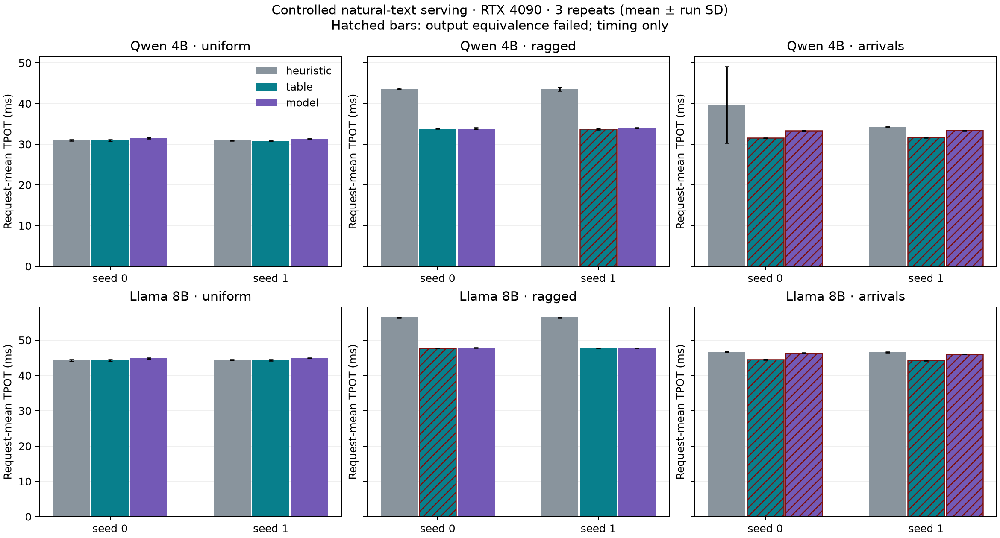

# 자연어·두 모델 후속 검증

RTX 4090 한 대에서 동일한 실측표·피팅 파라미터를 고정하고 두 모델, 세 시나리오, 두 시드를 측정했다. 각 조합은 세 정책을 세 번 반복하며 실행 순서를 회전한다. 입력은 직접 작성한 문단으로 구성했으며 운영 트래픽이나 표준 언어 품질 벤치마크가 아니다.

예비 측정은 요청당 decode 2스텝으로 워밍업을 제한했다. 요청 합류 시 실제 최대 배치를 워밍업하지 못하므로 최종 성능 근거에는 전체 워밍업 캠페인을 사용한다.

기존 측정 격자와 다른 배치 28, 짧은 문맥 384, 긴 문맥 12,288토큰을 사용했다. 두 모델의 attention head 구성은 같으므로 다른 head 구성이나 다른 GPU로의 일반화는 검증하지 않는다.

TPOT는 요청별 토큰 간 시간의 평균이며 도착 요청의 직렬 prefill과 정책 선택 비용을 포함한다. 배율은 같은 모델·시나리오·시드·반복의 휴리스틱 TPOT ÷ 해당 정책 TPOT이다. 생성 토큰 또는 스케줄이 다르면 배율을 성능 개선의 근거로 표시하지 않는다.

출력 검증을 통과한 정책·입력 조합은 **14/24개**다. 아래 표에는 불일치 사례도 모두 포함한다. 전체 캠페인의 종료 코드 1은 검증 불일치가 보존됐다는 뜻이며, 완료 여부는 각 manifest의 `status`로 확인한다.

| 모델 | 조건 | 시드 | 정책 | TPOT ms | 배율 | 출력 검증 |
|---|---|---:|---|---:|---:|---|
| Qwen 4B | uniform | 0 | model | 31.531 | 0.983× | 일치 |
| Qwen 4B | uniform | 0 | table | 30.936 | 1.001× | 일치 |
| Qwen 4B | uniform | 1 | model | 31.345 | 0.986× | 일치 |
| Qwen 4B | uniform | 1 | table | 30.840 | 1.003× | 일치 |
| Qwen 4B | ragged | 0 | model | 33.890 | 1.289× | 일치 |
| Qwen 4B | ragged | 0 | table | 33.873 | 1.289× | 일치 |
| Qwen 4B | ragged | 1 | model | 34.015 | 1.281× | 일치 |
| Qwen 4B | ragged | 1 | table | 33.765 | — | 불일치/미검증 |
| Qwen 4B | arrivals | 0 | model | 33.345 | — | 불일치/미검증 |
| Qwen 4B | arrivals | 0 | table | 31.516 | — | 불일치/미검증 |
| Qwen 4B | arrivals | 1 | model | 33.431 | — | 불일치/미검증 |
| Qwen 4B | arrivals | 1 | table | 31.658 | — | 불일치/미검증 |
| Llama 8B | uniform | 0 | model | 44.850 | 0.988× | 일치 |
| Llama 8B | uniform | 0 | table | 44.316 | 1.000× | 일치 |
| Llama 8B | uniform | 1 | model | 44.922 | 0.988× | 일치 |
| Llama 8B | uniform | 1 | table | 44.365 | 1.001× | 일치 |
| Llama 8B | ragged | 0 | model | 47.817 | 1.181× | 일치 |
| Llama 8B | ragged | 0 | table | 47.691 | — | 불일치/미검증 |
| Llama 8B | ragged | 1 | model | 47.736 | 1.182× | 일치 |
| Llama 8B | ragged | 1 | table | 47.674 | 1.184× | 일치 |
| Llama 8B | arrivals | 0 | model | 46.314 | — | 불일치/미검증 |
| Llama 8B | arrivals | 0 | table | 44.475 | — | 불일치/미검증 |
| Llama 8B | arrivals | 1 | model | 45.972 | — | 불일치/미검증 |
| Llama 8B | arrivals | 1 | table | 44.286 | — | 불일치/미검증 |

## 정책 선택 비용

아래 첫 호출·캐시 miss·hit는 서로 겹치지 않는 분류다. C 실행 경로의 컴파일/로드는 시작 단계에 수행하고 manifest의 `policy_setup_runs`에 따로 기록했다. 첫 호출에는 새 길이 구성의 전체 후보 예측이 포함된다.

| 모델 | 조건 | 시드 | 첫 호출 µs | 후속 miss µs | hit µs |
|---|---|---:|---:|---:|---:|
| Qwen 4B | uniform | 0 | 14760.6 | — | 6.3 |
| Qwen 4B | uniform | 1 | 14878.1 | — | 6.7 |
| Qwen 4B | ragged | 0 | 13499.6 | — | 6.6 |
| Qwen 4B | ragged | 1 | 13496.2 | — | 6.3 |
| Qwen 4B | arrivals | 0 | 1063.5 | 7069.1 | 5.2 |
| Qwen 4B | arrivals | 1 | 1038.3 | 7068.0 | 5.8 |
| Llama 8B | uniform | 0 | 14887.4 | — | 7.0 |
| Llama 8B | uniform | 1 | 14658.0 | — | 6.3 |
| Llama 8B | ragged | 0 | 13552.4 | — | 6.6 |
| Llama 8B | ragged | 1 | 13276.2 | — | 6.5 |
| Llama 8B | arrivals | 0 | 1033.4 | 7242.8 | 6.6 |
| Llama 8B | arrivals | 1 | 1050.9 | 7203.7 | 6.1 |

개별 반복의 시간은 [repetitions.csv](repetitions.csv), 반복 평균·표준편차, 95% paired bootstrap 구간, 비교 불가 사유와 입력·소스 식별자는 [summary.csv](summary.csv)에 보존한다. 이는 세 번 반복한 해당 실험의 변동이며 서비스 전체에 대한 보장 구간이 아니다.

