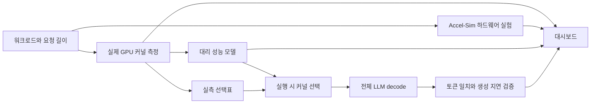

# KernelScope 졸업 프로젝트

**주제: 길이가 다른 요청이 섞인 LLM 추론에서, attention 커널 선택이 실제 토큰 생성 시간에 미치는 영향.**

KernelScope는 기존 attention 구현을 같은 입력으로 비교하고, GPU 자원과 실행 형태로 병목을 설명하며, 같은 모델의 실제 decode 과정에서 커널 선택 정책을 교체하는 실험 시스템이다.

## 연구 질문과 기여

1. **어디서 느려지는가?** 균일 배치와 긴·짧은 요청이 섞인 배치를 구분한다. CUDA 시간, 실행 블록 수, KV 길이 분포를 연결해 라이브러리의 split 선택이 불리한 구간을 찾는다.
2. **무엇을 바꾸면 도움이 되는가?** 가중치·입력·배치 순서를 유지하고 attention의 `num_splits`만 바꾼다. 기존 휴리스틱, 고정 split, 실측표, 대리 성능 모델을 비교한다.
3. **커널의 이득이 사용자 지연으로 이어지는가?** attention 시간과 전체 decode 시간, 정책 선택 CPU 시간, 요청별 토큰 간 지연(TPOT)을 함께 기록한다. prompt 처리 때문에 생긴 지연도 별도로 보존한다.
4. **어디까지 일반화할 수 있는가?** 성능 모델의 보간·다른 head 구성·ragged 조건 검증을 분리하고, 하드웨어 what-if는 예측으로 표시한다.

후속 검증은 기존 실측표와 계수를 고정한 채 **두 모델 × 세 자연어 입력 조건 × 두 시드**로 확장한다. 각 조건은 독립적으로 비교하고, 첫 선택·이후 cache miss·hit의 비용을 나눠 선택 계산 자체의 병목도 설명한다. [실험 결과와 원본 표](experiments/followup/README.md) · [선택 비용 개선](experiments/2026-09-22-policy-latency.md)

기여는 새로운 attention 수식이나 새로운 GPU 시뮬레이터가 아니다. 재현 가능한 측정 기반, 길이 분포에 따른 선택 오류의 분석, 예측 모델, 실제 LLM 실행의 정책 교체, 그리고 결과를 검토할 수 있는 데모를 하나로 연결한다.

## 시스템

## 공정한 비교 규약

- 커널 실험에서는 warm/cold 캐시와 dense/paged KV 형식을 분리한다. 전체 LLM 실험은 자연스럽게 실행되는 레이어의 캐시 상태를 사용한다.
- 모든 정책에 같은 모델 가중치, 프롬프트, 생성 길이, 요청 순서, 논리적 도착 step을 적용한다. greedy 생성이며 EOS에 따라 조기 종료하지 않는 고정 길이 성능 실험이다.
- warm-up 결과와 본 측정을 분리하고 반복별 결과를 저장한다. 정책 평가 순서를 회전시켜 순서에 따른 편향을 줄인다.
- 커널 이벤트 시간과 CPU 정책 선택을 포함한 host 관측 decode 시간을 혼동하지 않는다. 생성 토큰 간 실제 timestamp 차이는 별도 TPOT로 기록한다.
- 생성 토큰을 정책 간 비교한다. 독립 Hugging Face 구현과의 수치 검증은 커널 선택 간 비교와 별도로 수행한다. bf16 연산 순서에 따른 차이가 생기면 토큰 불일치를 숨기지 않는다.
- 최적 커널 대비 손실은 `선택한 커널 시간 / 측정된 최적 시간 - 1`이다. 실측표의 최적값은 같은 후보 집합 안에서의 최적값이다.

## 결과 해석의 한계

실제 전체 모델 결과도 확보했다. 2026-09-22 Qwen3-4B 실험의 32K 1개 + 512토큰 31개 배치에서 실측표 기반 선택의 TPOT는 **61.06 → 33.80ms(1.81배)**였고, 5회 반복의 생성 토큰은 휴리스틱과 모두 같았다. 같은 실험에서 모델 기반 선택은 초기 CPU 계산 비용을 포함해 약 1.35배였다. 이 수치는 해당 조건에 대한 결과이며 uniform 대조군에서는 실측표 개선이 거의 없었다.

이 엔진은 전체 모델을 실행하는 단일 프로세스 연속 배치 실험기다. HTTP 부하, 네트워크, CUDA Graph, 여러 GPU, 운영용 서버 스케줄러의 우월성을 검증한 결과로 확대하지 않는다. 초기 실험은 합성 토큰, 후속 실험은 직접 작성한 문단을 길이에 맞춰 구성한 자연어 입력을 사용한다. 둘 다 표준 자연어 답변 품질 평가나 실제 운영 요청의 재현은 아니다.

대리 모델은 실제 GPU 측정으로 피팅한 근사치다. 새로운 하드웨어에서의 속도 개선은 실제 장비나 보정된 시뮬레이터로 검증하기 전까지 예측이다. 특히 기존 RTX 4090 Accel-Sim 모델에는 캐시·타이밍 보정 문제가 남아 있다.

2026-09-22 재검증에서 대리 모델의 실행 시간 예측 오차 중앙값은 2.3–12.3%로 각 검증 집합의 목표 안에 들었다. 그러나 최악의 커널 선택 손실은 목표를 넘었다. 따라서 모델을 보편적으로 최적인 정책으로 제시하지 않는다. [검증 표](plan/2026-09-22-model-validation.md)

후속 작업을 포함한 CPU 테스트는 462개 통과(4개 skip, GPU 12개 제외)했다. 초기 decoder/KV GPU 테스트 7개 통과 기록과 두 모델의 전체 생성 캠페인도 보존한다. [후속 결과와 해석](experiments/2026-09-22-followup.md), [초기 전체 모델 성능 결과](experiments/2026-09-22-serving-results.md), [초기 출력 차이의 수치 진단](experiments/2026-09-22-numerics.md)을 함께 제공한다.

## 재현과 발표

- [실행 안내](../README.md): 설치 환경, 커널 측정, 서빙 실험, 대시보드 실행.
- `scripts/demo.sh`: GPU 없이도 저장된 실측 결과를 보는 대시보드.
- `scripts/package_demo.py`: 실측 요약과 서빙 결과를 원본 해시와 함께 `demo_data/`로 복사한다.
- [발표 시나리오](demo.md): 5분 동안 문제, 원인, 선택, 실제 결과, 한계를 설명한다.
- 테스트용 fake 모델·CPU 결과는 실행 로직 검증용이다. GPU 성능 결과로 사용하지 않는다.
